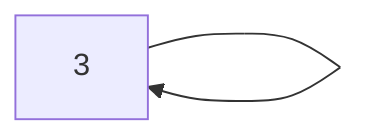

# 来源
模拟退火算法来源于固体退火原理，是一种基于概率的算法，将固体加温至充分高，再让其徐徐冷却，加温时，固体内部粒子随温升变为无序状，内能增大，而徐徐冷却时粒子渐趋有序，在每个温度都达到平衡态，最后在常温时达到基态，内能减为最小。模拟退火算法(Simulated Annealing，SA)最早的思想是由N. Metropolis等人于1953年提出。1983年，S. Kirkpatrick 等成功地将退火思想引入到组合优化领域。它是基于Monte-Carlo迭代求解策略的一种随机寻优算法，其出发点是基于物理中固体物质的退火过程与一般组合优化问题之间的相似性。

# 数学推导
:::info
来源： Metropolis准则
:::
以概率接新的状态：
- 温度为$T$的时候，设当前状态为$i$,之后的状态为$j$，如果$E_i > E_j$ 则选择接受新的状态
- 否则，let $p = e^{- \frac{(E_j - E_i)}{KT}}$,其中 K 为玻耳兹曼常量，$K = 1.380649 × 10^{-23} J/K$。
  - 如果概率p大于$[0,1)$区间中的随机数，则接受j为新状态
  - 如果概率p小于等于这一个值，保留i当前状态。

:::info
1. $p = e^{\frac{-(E_j - E_i)}{KT}}$ 中，T越大，可接受与当前能量差大的状态为新状态；T越小，此容差范围越小。
2. 精髓：随机数
:::

# 流程
参数：$T_0$ $T_k$ $\Delta$
- $T_0$ 为初始温度
- $T_k$ 为结束温度
- $\Delta$ 为温度更新权重，$T_i = \Delta \cdot T_{i-1}$。如果$\Delta$大，退火快，容易局部最优；$\Delta$小，迭代次数多，耗时长。实际应用中采用退火温度表。初期采用较大，后期减小

